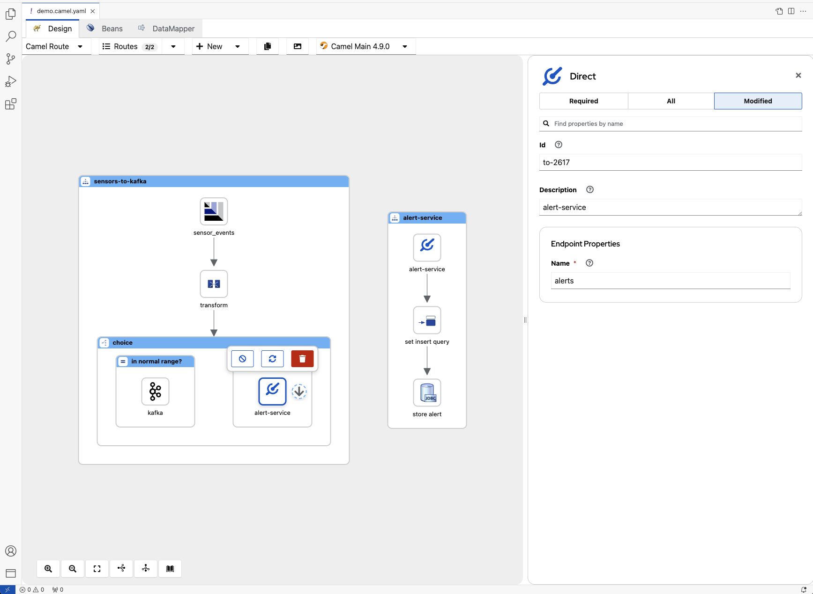
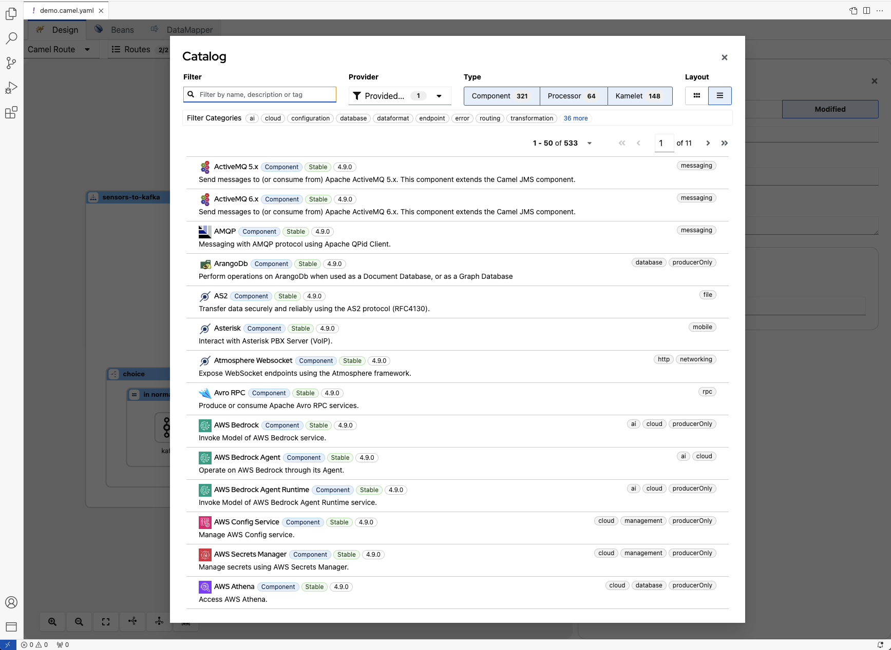

<h1 align="center">
  
</h1>

  
  
  
  
   
  
  

 

<h2 align="center">Kaoto - The Integration Designer for <a href="https://camel.apache.org">Apache Camel</a></h2>

  <a href="#features">Features</a> •
  <a href="#requirements">Requirements</a> •
  <a href="https://kaoto.io/docs/installation">Documentation</a> •
  <a href="#issues">Issues</a>  •
  <a href="#data-and-telemetry">Telemetry</a>

<a href="https://www.kaoto.io">Kaoto</a> is an integration editor to create and deploy workflows in a visual, low-code way, with developer-friendly features like a code editor and deployments to the cloud. Kaoto augments user productivity via <a href="https://camel.apache.org">Apache Camel</a>. It accelerates new users and helps experienced developers.

 

### Features

- Edit Camel files following pattern (`*.camel.yaml` and `*.camel.yml`).
- Edit Kamelet files following pattern (`*.kamelet.yaml` and `*.kamelet.yml`).
- Edit Pipe files following pattern (`*.pipe.yaml`, `*.pipe.yml`, `*-pipe.yaml` and `*-pipe.yml`)
- Browse Kaoto supported files within `Kaoto: Integrations` view
- Init Camel `Routes`, `Pipes` and `Kamelets` within `Kaoto: Integrations` view
- Allow to edit `*.yaml` and `*.yml` when opening through contextual menu.
- Setting to provide custom set of catalog

### Limitations

- Kaoto files are always written and overwritten with `Linux-style` end of line (EOL).

### Embedded

- [Kaoto](https://github.com/KaotoIO/kaoto) in version [2.5.0-M2](https://github.com/KaotoIO/kaoto/releases/tag/2.5.0-M2).

### Issues

Something is not working properly? In that case, feel free to [open issues, add feature requests, report bugs, etc.](https://github.com/KaotoIO/vscode-kaoto/issues).

### Snapshots versions

If you're eager to test latest snapshots, there are 2 kind of binary (`*.vsix`) available:

- Snapshot based on main branch of VS Code Kaoto using a released version of Kaoto. Pick latest on [this site](https://download.jboss.org/jbosstools/vscode/snapshots/vscode-kaoto/)
- Snapshot based on main branch of VS Code Kaoto using the main branch of Kaoto (at time of last build of VS Code Kaoto main branch). Click on latest finished of [this workflow](https://github.com/KaotoIO/vscode-kaoto/actions/workflows/main-kaoto.yaml?query=branch%3Amain), then download the artifact named `vsix-from-main-branch-of-kaoto`, then extract the vsix binary from `vsix-from-main-branch-of-kaoto.zip` downloaded.

To install the vsix binary, see the [official documentation](https://code.visualstudio.com/docs/editor/extension-marketplace#_install-from-a-vsix).

### Get Involved

If you'd like to help us get better, we appreciate it!
Check out our [Contribution Guide](CONTRIBUTING.md) on how to do that.

### Data and Telemetry

The Kaoto for Visual Studio Code extension collects anonymous [usage data](USAGE_DATA.md) and sends it to Red Hat servers to help improve our products and services. Read our [privacy statement](https://developers.redhat.com/article/tool-data-collection) to learn more. This extension respects the `redhat.telemetry.enabled` setting which you can learn more about at [How to disable Telemetry reporting](https://github.com/redhat-developer/vscode-redhat-telemetry#how-to-disable-telemetry-reporting).
