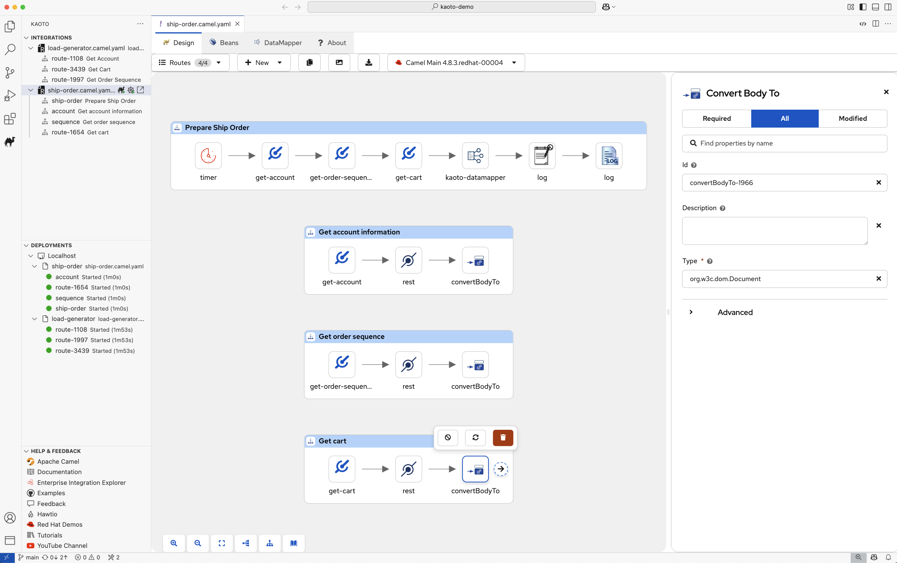

  
  

<h2 align="center">Kaoto - The Integration Designer for <a href="https://camel.apache.org">Apache Camel</a></h2>

  <a href="#feature-highlights">Features</a> •
  <a href="#installation">Installation</a> •
  <a href="https://kaoto.io/docs/manual/">Documentation</a> •
  <a href="#feedback">Feedback</a>  •
  <a href="#data--telemetry">Telemetry</a>

<a href="https://www.kaoto.io">Kaoto</a> lowers the barrier to getting started with <a href="https://camel.apache.org">Apache Camel</a>, enabling users to quickly prototype and integrate systems without deep Camel knowledge or complex Java coding. With a modern, open-source visual designer, Kaoto empowers teams to build and test integrations efficiently in a low-code environment, accelerating the development process.

 

## Feature Highlights

<i>Kaoto has been designed with a focus on enabling users to quickly prototype Apache Camel integrations without deep Camel knowledge or having to write complex Java code.</i>

<table>
<tr>
<td width="33%" align="center">
 
<b>Based on Apache Camel</b> 
Kaoto utilizes the Apache Camel models and schemas to always offer you all available upstream Camel features.
</td>
<td width="33%" align="center">
 
<b>VS Code Extension</b> 
Kaoto comes as an extension you can easily install from the <a href="https://marketplace.visualstudio.com/items?itemName=redhat.vscode-kaoto">VS Code Marketplace</a>. Install it directly from inside your VS Code instance.
</td>
<td width="33%" align="center">
 
<b>Care About Developers</b> 
Kaoto is a low-code / no-code visual editor for Apache Camel integrations. Using Kaoto will lower the barrier for integration developers to get started with Apache Camel.
</td>
</tr>
<tr>
<td width="33%" align="center">
 
<b>Free Libre and Open Source</b> 
Truly open with no vendor lock-in. Use, reuse, share, modify, and resell to your needs. Own Kaoto and make it yours, making sure your use cases are covered.
</td>
<td width="33%" align="center">
 
<b>Built-In Catalog</b> 
Kaoto provides you access to a catalog of 300+ Camel Components, 200+ Kamelets and a variety of Enterprise Integration Patterns to choose from. Each comes with documentation to help you get started.
</td>
<td width="33%" align="center">
 
<b>Rapid Prototyping</b> 
Building your integration while running it in parallel in Dev Mode gives you a quick turnaround on your changes and enables you to quickly prototype your Camel routes.
</td>
</tr>
</table>

---

<table><tr>
<td valign="middle" width="40%">
<h3>Visual Integration Editor</h3>
Design your Camel routes, Kamelets and Pipes in a visual low-code / no-code way. Drag and drop components, connect them together, and see your integration flow come to life.
</td>
<td width="60%">

</td>
</tr></table>

---

<table><tr>
<td width="60%">

</td>
<td valign="middle" width="40%">
<h3>Built-in Catalog</h3>
Browse the comprehensive built-in catalog containing a vast number of available Camel Components (Connectors), Enterprise Integration Patterns as well as Kamelets provided by Apache Camel.
</td>
</tr></table>

---

<table><tr>
<td valign="middle" width="40%">
<h3>Easy Configuration</h3>
Selecting a figure on the graphical canvas will open up a configuration form to the right side which allows you to easily configure your components without writing code.
</td>
<td width="60%">

</td>
</tr></table>

---

<table><tr>
<td width="60%">

</td>
<td valign="middle" width="40%">
<h3>Built-in Data Mapping</h3>
Use the Kaoto DataMapper to map data between input and output structures and to transform it to your needs. Visually connect fields and apply transformations without writing complex code.
</td>
</tr></table>

---

<table><tr>
<td valign="middle" width="40%">
<h3>Powerful Sidebar Views</h3>
Browse integration files, orchestrate running Camel integrations, initialize new routes, export as Maven projects for Quarkus or Spring Boot, run locally, and deploy to OpenShift/Kubernetes - all from dedicated sidebar views.
</td>
<td width="60%">

</td>
</tr></table>

---

## Installation

You can follow [Installation Guide](https://kaoto.io/docs/installation) on a Kaoto official site or steps below:

1. Install **Visual Studio Code**
2. Install **JBang**
3. Install the **Kaoto extension** from the [VS Code Marketplace](https://marketplace.visualstudio.com/items?itemName=redhat.vscode-kaoto) or [Open VSX Registry](https://open-vsx.org/extension/redhat/vscode-kaoto)

## Documentation

Learn more about Kaoto and how to use it effectively:

- 📘 [User Manual](https://kaoto.io/docs/manual/) - In-depth guide on all features and configurations.
- 🚀 [Quickstart Guide](https://kaoto.io/docs/quickstart/) - Get started with Kaoto in minutes.
- 🛠️ [Installation Guide](https://kaoto.io/docs/installation/) - Step-by-step instructions for installing Kaoto.

### Supported Formats

- **Camel Route files**: `*.camel.yaml`, `*.camel.xml`
- **Kamelet files**: `*.kamelet.yaml`
- **Pipe files**: `*.pipe.yaml`
- **Citrus Test files**: `*.test.yaml`, `*.citrus.yaml`

## Feedback

We value your **feedback!** If you encounter any issues, have feature requests, or want to suggest improvements, please [open an issue](https://github.com/KaotoIO/vscode-kaoto/issues) in our repository.

We welcome **contributions!** Check out our [Contribution Guide](CONTRIBUTING.md) for details on how to help improve Kaoto.

## Data & Telemetry

The Kaoto VS Code extension collects anonymous [usage data](USAGE_DATA.md) to enhance our products. Read our [privacy statement](https://developers.redhat.com/article/tool-data-collection) for more details.

This extension respects the `redhat.telemetry.enabled` setting. Learn more: [Disable Telemetry](https://github.com/redhat-developer/vscode-redhat-telemetry#how-to-disable-telemetry-reporting).
