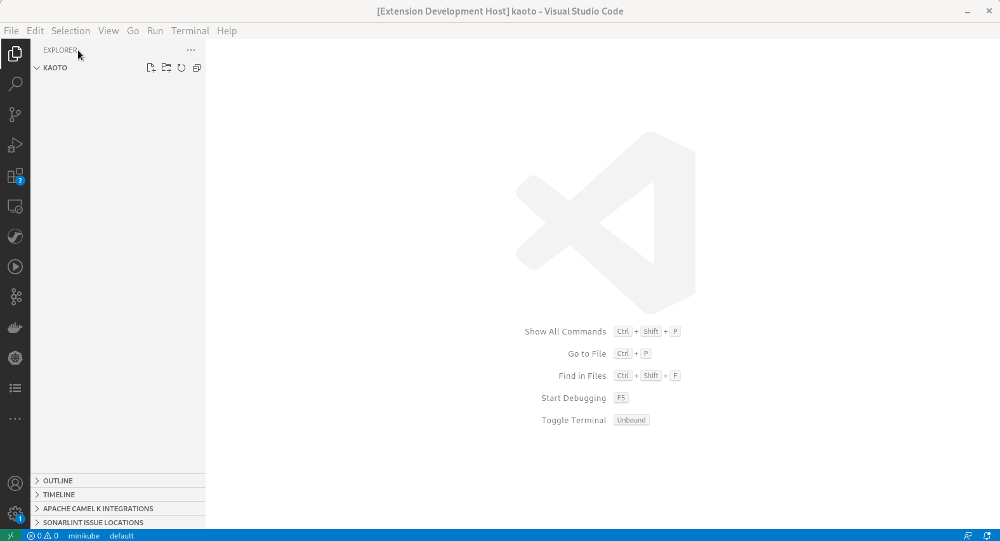

<h1 align="center">
  
</h1>

  
  
  
   
  
  

 

<h2 align="center">No Code and Low Code Integration editor</h2>

  <a href="#features">Features</a> •
  <a href="#requirements">Requirements</a> •
  <a href="https://kaoto.io/docs/">Documentation</a> •
  <a href="#issues">Issues</a>  •
  <a href="#data-and-telemetry">Telemetry</a>

<a href="https://www.kaoto.io">Kaoto</a> is an integration editor to create and deploy workflows in a visual, low-code way, with developer-friendly features like a code editor and deployments to the cloud. Kaoto augments user productivity via <a href="https://camel.apache.org">Apache Camel</a>. It accelerates new users and helps experienced developers.

 

### Features

- Edit Kaoto (`*.kaoto.yaml` and `*.kaoto.yml`) files.
- Edit Camel files following pattern (`*.camel.yaml` and `*.camel.yml`).
- Allow to edit `*.yaml` and `*.yml` when opening through contextual menu.

### Limitations

- Kaoto files are always written and overwritten with `Linux-style` end of line (EOL).
- Unsupported elements by Kaoto are removed from the files when opening them. The editor will open in dirty state in this case.

### Embedded

- [Kaoto UI](https://github.com/KaotoIO/kaoto-ui) in version [1.4.0](https://github.com/KaotoIO/kaoto-ui/releases/tag/v1.4.0).

### Issues

Something is not working properly? In that case, feel free to [open issues, add feature requests, report bugs, etc.](https://github.com/KaotoIO/vscode-kaoto/issues).

### Get Involved

If you'd like to help us get better, we appreciate it!
Check out our [Contribution Guide](CONTRIBUTING.md) on how to do that.

### Data and Telemetry

The Kaoto for Visual Studio Code extension collects anonymous [usage data](USAGE_DATA.md) and sends it to Red Hat servers to help improve our products and services. Read our [privacy statement](https://developers.redhat.com/article/tool-data-collection) to learn more. This extension respects the `redhat.telemetry.enabled` setting which you can learn more about at [How to disable Telemetry reporting](https://github.com/redhat-developer/vscode-redhat-telemetry#how-to-disable-telemetry-reporting).
