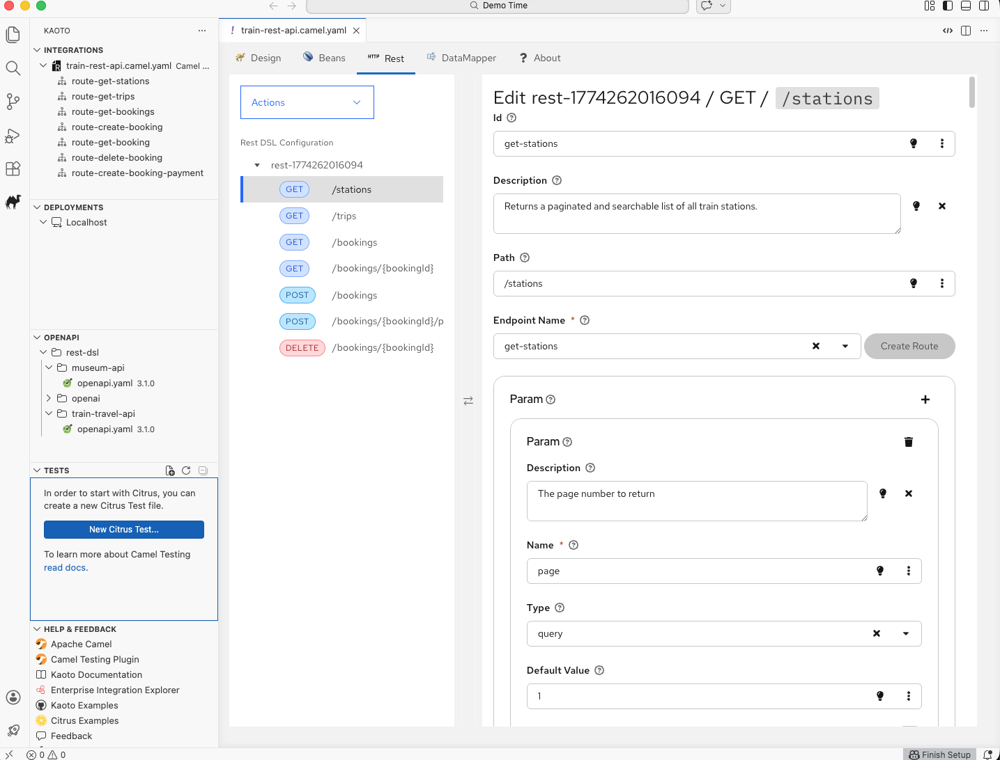
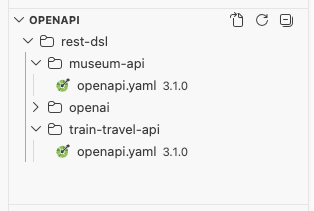
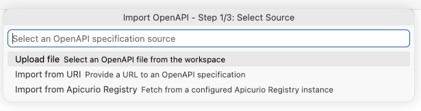

# Kaoto 2.10 released

We are happy to announce that new version of extension was released!

## Key highlights of this release

This release introduces a form-based REST DSL editor, an OpenAPI view with import capabilities, a powerful new Tests view for Citrus testing, enhanced OpenShift deployment capabilities, and upgrades to the latest Camel JBang 4.18.0. The REST DSL editor brings visual REST service management directly into the Kaoto editor, the new OpenAPI sidebar view lets you browse and import OpenAPI specifications, the Tests view provides comprehensive test management in VS Code, and the improved export functionality makes deploying to OpenShift easier than ever.

### REST DSL Editor

A new form-based REST DSL editor has been added to Kaoto, enabling visual creation and management of Apache Camel REST DSL configurations and services. This editor provides a split-panel interface for working with REST definitions without writing YAML by hand.

    

#### Create and Configure REST Services

The REST DSL editor makes it easy to define your REST API:

- **REST configurations**: Set up global REST settings such as host, port, and binding mode
- **REST services**: Define REST service blocks with base paths
- **HTTP methods**: Add GET, POST, PUT, DELETE, and HEAD operations with individual path and property configuration
- **Route endpoints**: Configure direct route endpoints for each REST method to connect to your Camel routes

#### Tree View Navigation

The left panel displays your REST DSL structure in a navigable tree:

- **Hierarchical view**: REST configurations and services are shown as top-level nodes with HTTP methods as children
- **Method badges**: Color-coded badges visually distinguish between GET, POST, PUT, DELETE, and HEAD operations
- **Click to edit**: Select any node in the tree to load its properties in the right-side form editor

#### Toolbar Actions

Use the toolbar to manage your REST definitions:

- **Add REST Configuration**: Create a new global REST configuration
- **Add REST Service**: Add a new REST service block
- **Add Operation**: Open a modal to choose an HTTP method and path for a new operation
- **Delete**: Remove the currently selected REST entity

#### REST Configuration User Settings

New user settings have been added under the **REST Configuration** section to support the REST editor and OpenAPI import workflows:

- **`kaoto.restConfiguration.apicurioRegistryUrl`**: Pre-configure the URL to your Apicurio Registry instance (e.g. `https://registry.example.com/apis/registry/v3`) so it is readily available during OpenAPI import
- **`kaoto.restConfiguration.customMediaTypes`**: Define custom media types (e.g. `application/vnd.api+json`) that become available in the Rest DSL Consumes/Produces fields

---

### OpenAPI View

A new **OpenAPI** section has been added to the Kaoto sidebar! This view automatically discovers and lists OpenAPI specification files in your workspace, and provides a guided import wizard to generate Camel routes from them.

    

#### Browse OpenAPI Specifications

The OpenAPI view scans your workspace for specification files and displays them in a tree structure:

- **Automatic discovery**: Detects files matching `*openapi.yaml` and `*openapi.json` patterns
- **Content validation**: Only files containing a valid `openapi` field are shown, filtering out false matches
- **Version display**: Each file shows its OpenAPI specification version
- **Tree navigation**: Files are organized by workspace folders and Maven project structure
- **Quick actions**: Right-click to show the source or delete a specification file

#### Import OpenAPI Specification

Click the **Import** button in the OpenAPI view toolbar to launch a guided 3-step wizard that generates Camel integration files from an OpenAPI specification:

- **Step 1 - Select Source**: Choose how to provide the specification:
  - **Upload file**: Pick an existing OpenAPI file from the workspace
  - **Import from URI**: Enter a URL pointing to a remote OpenAPI specification
  - **Import from Apicurio Registry**: Browse and select artifacts from a configured Apicurio Registry instance
- **Step 2 - Select Operations**: Review the discovered operations and pick which ones to import
- **Step 3 - Define Output**: Choose whether to generate REST DSL definitions, direct route stubs, or both

The wizard then creates a new `.camel.yaml` file with the generated content and opens it in Kaoto.

    

#### OpenAPI File Regex User Setting

Customize which files are recognized as OpenAPI specifications using the `kaoto.openapi.files.regexp` setting:

- **Configurable patterns**: Define glob patterns to match your file naming conventions
- **Default patterns**: Pre-configured with `*openapi.yaml` and `*openapi.json`
- **Dynamic updates**: The view automatically refreshes when the setting changes

---

### Tests view

A brand new view dedicated to managing and running Citrus tests has been added to the Kaoto sidebar! This view provides a complete testing workflow for your Apache Camel integrations using the Citrus framework.

    

#### Create New Test Files

Get started quickly with the **New Citrus Test...** button at the top of the Tests view:

- **Quick test creation**: Initialize a new Citrus test file with a single click
- **Template-based**: Creates a properly structured test file ready for your test scenarios
- **Integrated workflow**: New test files are immediately visible in the Tests view

    

#### Tree-like structure

The Tests view displays your workspace in a hierarchical tree structure, making it easy to navigate and organize your test files:

- **Workspace roots and nested folders**: Browse through your project structure with all folders containing Citrus test files
- **Maven project awareness**: Highlights Maven roots and their children, helping you understand your project organization
- **Test file discovery**: Automatically detects Citrus test files matching patterns like `*.citrus.yaml`, `*.citrus.test.yaml`, `*.citrus.it.yaml`, `*.citrus-test.yaml`, and `*.citrus-it.yaml`

#### Buttons for running Single Tests or Folders

Execute your tests with ease using the inline action buttons:

- **Run Single Test**: Click the run button next to any test file to execute it individually
- **Run Folder**: Execute all tests within a specific folder at once
- **Visual feedback**: Tests show running status with a spinning icon and display pass/fail results with color-coded icons
- **Test results persistence**: Results are preserved across view refreshes so you can track your testing progress

    
    

#### Tests view File Regex User setting

Customize which files are recognized as tests using the new `kaoto.tests.files.regexp` setting:

- **Flexible pattern matching**: Define custom regex patterns to match your test file naming conventions
- **Default patterns included**: Comes pre-configured with common Citrus test file patterns
- **Dynamic updates**: The view automatically refreshes when you change the setting

    

---

### OpenShift Deployment Enhancements

Deploying your Camel integrations to OpenShift is now more streamlined with enhanced export capabilities:

#### Export with OpenShift Configurations

When exporting Maven projects (Quarkus or Spring Boot), Kaoto now automatically includes:

- **VS Code launch configurations**: Ready-to-use debug and run configurations for deploying directly to OpenShift from VS Code
- **One-click deployment**: Simply export your project and use the provided launch configurations to deploy

    

This makes the journey from development to OpenShift deployment faster and more intuitive, especially for developers new to Kubernetes and OpenShift.

---

### Camel JBang Upgrade

This release upgrades the default Camel JBang version from **4.16.0 to 4.18.0**, bringing you the latest features, improvements, and bug fixes from the Apache Camel community.

---

For a full list of changes please refer to the [change log.](https://github.com/KaotoIO/kaoto/releases/tag/2.10.0)

### Let’s Build it Together

Let us know what you think by joining us in the [GitHub discussions](https://github.com/orgs/KaotoIO/discussions).
Do you have an idea how to improve Kaoto? Would you love to see a useful feature implemented or simply ask a question? Please [create an issue](https://github.com/KaotoIO/kaoto/issues/new/choose).

### A big shoutout to our amazing contributors

Thank you to everyone who made this release possible!

Whether you are contributing code, reporting bugs, or sharing feedback in our [GitHub discussions](https://github.com/KaotoIO/kaoto/discussions), your involvement is what keeps the Camel riding! 🐫🎉
