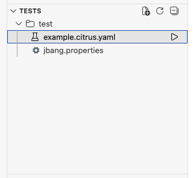
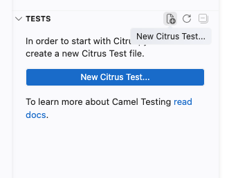
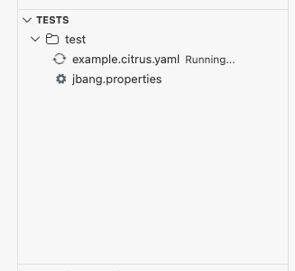
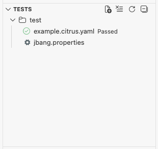
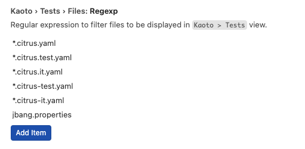
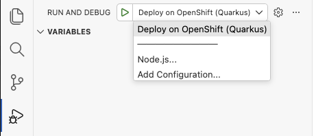

# Kaoto 2.10 released

We are happy to announce that new version of extension was released!

## Key highlights of this release

This release introduces a powerful new Tests view for Citrus testing, enhanced OpenShift deployment capabilities, and upgrades to the latest Camel JBang 4.18.0. The Tests view brings comprehensive test management directly into VS Code, while the improved export functionality makes deploying to OpenShift easier than ever.

### Tests view

A brand new view dedicated to managing and running Citrus tests has been added to the Kaoto sidebar! This view provides a complete testing workflow for your Apache Camel integrations using the Citrus framework.

    

#### Create New Test Files

Get started quickly with the **New Citrus Test...** button at the top of the Tests view:

- **Quick test creation**: Initialize a new Citrus test file with a single click
- **Template-based**: Creates a properly structured test file ready for your test scenarios
- **Integrated workflow**: New test files are immediately visible in the Tests view

    

#### Tree-like structure

The Tests view displays your workspace in a hierarchical tree structure, making it easy to navigate and organize your test files:

- **Workspace roots and nested folders**: Browse through your project structure with all folders containing Citrus test files
- **Maven project awareness**: Highlights Maven roots and their children, helping you understand your project organization
- **Test file discovery**: Automatically detects Citrus test files matching patterns like `*.citrus.yaml`, `*.citrus.test.yaml`, `*.citrus.it.yaml`, `*.citrus-test.yaml`, and `*.citrus-it.yaml`

#### Buttons for running Single Tests or Folders

Execute your tests with ease using the inline action buttons:

- **Run Single Test**: Click the run button next to any test file to execute it individually
- **Run Folder**: Execute all tests within a specific folder at once
- **Visual feedback**: Tests show running status with a spinning icon and display pass/fail results with color-coded icons
- **Test results persistence**: Results are preserved across view refreshes so you can track your testing progress

    
    

#### Tests view File Regex User setting

Customize which files are recognized as tests using the new `kaoto.tests.files.regexp` setting:

- **Flexible pattern matching**: Define custom regex patterns to match your test file naming conventions
- **Default patterns included**: Comes pre-configured with common Citrus test file patterns
- **Dynamic updates**: The view automatically refreshes when you change the setting

    

---

### OpenShift Deployment Enhancements

Deploying your Camel integrations to OpenShift is now more streamlined with enhanced export capabilities:

#### Export with OpenShift Configurations

When exporting Maven projects (Quarkus or Spring Boot), Kaoto now automatically includes:

- **VS Code launch configurations**: Ready-to-use debug and run configurations for deploying directly to OpenShift from VS Code
- **One-click deployment**: Simply export your project and use the provided launch configurations to deploy

    

This makes the journey from development to OpenShift deployment faster and more intuitive, especially for developers new to Kubernetes and OpenShift.

---

### Camel JBang Upgrade

This release upgrades the default Camel JBang version from **4.16.0 to 4.18.0**, bringing you the latest features, improvements, and bug fixes from the Apache Camel community.

---

For a full list of changes please refer to the [change log.](https://github.com/KaotoIO/kaoto/releases/tag/2.10.0)

### Let’s Build it Together

Let us know what you think by joining us in the [GitHub discussions](https://github.com/orgs/KaotoIO/discussions).
Do you have an idea how to improve Kaoto? Would you love to see a useful feature implemented or simply ask a question? Please [create an issue](https://github.com/KaotoIO/kaoto/issues/new/choose).

### A big shoutout to our amazing contributors

Thank you to everyone who made this release possible!

Whether you are contributing code, reporting bugs, or sharing feedback in our [GitHub discussions](https://github.com/KaotoIO/kaoto/discussions), your involvement is what keeps the Camel riding! 🐫🎉
