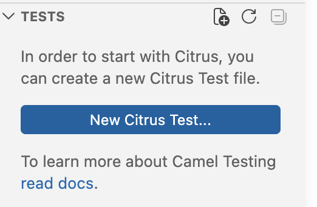
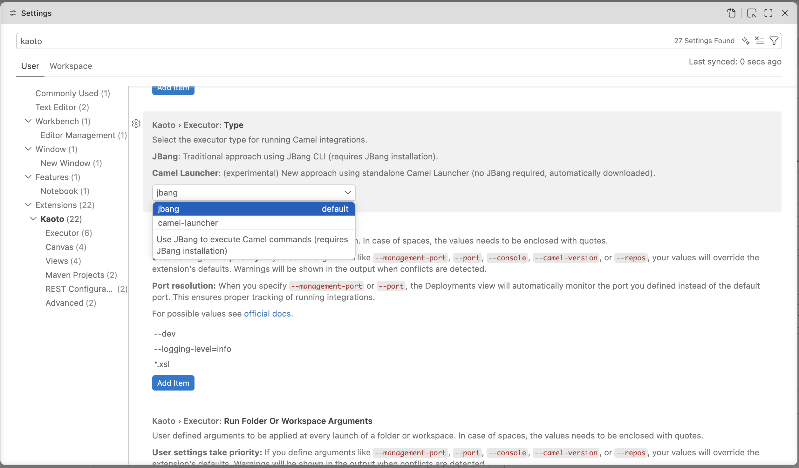
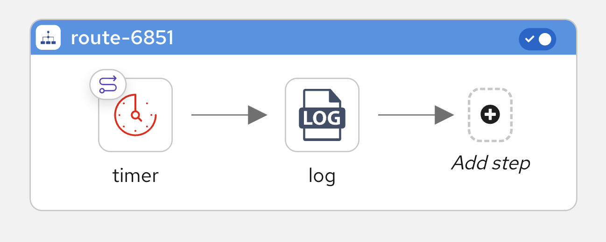
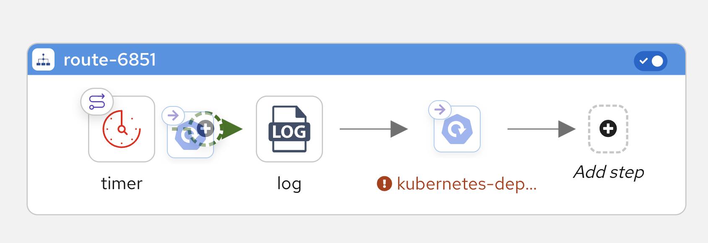

# Kaoto 2.11 released

We are happy to announce that new version of extension was released!

## Key highlights of this release

This release brings significant enhancements to testing capabilities with Citrus framework integration, expanded DataMapper functionality for complex schema handling, improved runtime management with multiple executor options, and visual editor improvements. Powered by Apache Camel 4.20.0, Kaoto continues to make visual integration design more powerful and intuitive.

### Citrus Testing Capabilities

Kaoto 2.11 introduces comprehensive Citrus framework integration, bringing automated testing capabilities directly into your visual integration design workflow:

- **Visual Test Design**: Create and manage Citrus tests directly within Kaoto's visual editor with dedicated test action icons and a test action library (send, receive, echo, sleep, etc.)
- **Auto-Open in Kaoto Editor**: Citrus test files (`*.citrus.yaml`, `*.citrus.test.yaml`, `*.citrus.it.yaml`, `*.citrus-test.yaml`, `*.citrus-it.yaml`) now automatically open in the Kaoto visual editor
- **Test Execution**: Run Citrus tests directly from Kaoto's Tests view to validate your integration behavior during development
- **Citrus Endpoint Configuration**: Specialized configuration fields for Citrus endpoints with proper protocols and message formats

    

    

---

### Catalog and Runtime Management

#### Multiple Executors

The extension now supports two executor backends, selectable via the `kaoto.executor.type` setting:

- **Camel CLI** (default): The traditional and stable Camel JBang CLI executor with full feature support
- **Camel Launcher** (experimental): A new executor that requires no JBang installation — the launcher JAR is automatically downloaded and managed by the extension (Java required)

All executor-related settings are consolidated under the `kaoto.executor.*` namespace.

    

#### Catalog Version Picker

A new **status bar item** shows the currently selected Camel catalog version and lets you switch between available versions with a single click. The picker filters catalogs based on the open file — showing Camel runtimes (Main, Quarkus, Spring Boot) for integration files and Citrus versions for test files.

#### Red Hat Productized Versions

When using Red Hat productized Camel versions (e.g. `4.8.0.redhat-00017`), you **must** configure the Red Hat recommended repositories in your Maven `settings.xml`. The extension will show a notification guiding you through this setup when a productized catalog is selected.

---

### DataMapper Enhancements

- **Rendering Engine Re-invented**: Enterprise-grade rendering with virtual scrolling for flawless navigation through large data mappings with complex document schemas
- **Field Override**: Support for overriding document fields using XML schema substitution groups and `xs:extension`/`xs:restriction` hierarchies
- **Abstract Elements**: Substitution candidates shown as children in the document tree for direct mapping
- **Choice Improvements**: Enhanced `xs:choice` support with dedicated context menu options
- **Auto Mapping via Drag & Drop**: Automatic for-each, copy-of, or individual child mappings when dragging between compatible fields
- **Double-Click XPath Editing**: Double-click a target field to write XPath expressions directly
- **XSLT Comments**: Add comments to generated XSLT with tooltip preview on hover

---

### Canvas and Visual Editor

- **Route AutoStartup Toggle**: Toggle switch in the route title bar for controlling the autoStartup property
- **Space Bar Navigation**: Move the canvas by pressing and holding the Space bar
- **Container Selection Styles**: Visual feedback highlighting possible drop zones when moving elements
- **Property Search in REST Editor**: Search functionality for quickly finding properties in the REST DSL editor
- **Custom Properties Configuration**: Key/value configuration format for endpoint properties in components like To, ToD, and Kamelet

    

    

---

### Camel JBang Upgrade

This release upgrades the default Camel JBang version from **4.18.0 to 4.20.0**, bringing the latest features, performance improvements, and bug fixes from the Apache Camel community.

---

For a full list of changes please refer to the [change log.](https://github.com/KaotoIO/kaoto/releases/tag/2.11.0)

### Let's Build it Together

Let us know what you think by joining us in the [GitHub discussions](https://github.com/orgs/KaotoIO/discussions).
Do you have an idea how to improve Kaoto? Would you love to see a useful feature implemented or simply ask a question? Please [create an issue](https://github.com/KaotoIO/kaoto/issues/new/choose).

### A big shoutout to our amazing contributors

Thank you to everyone who made this release possible!

Whether you are contributing code, reporting bugs, or sharing feedback in our [GitHub discussions](https://github.com/KaotoIO/kaoto/discussions), your involvement is what keeps the Camel riding! 🐫🎉
