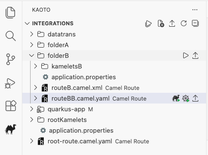
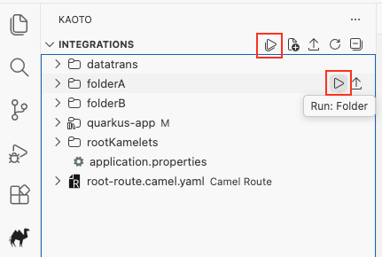
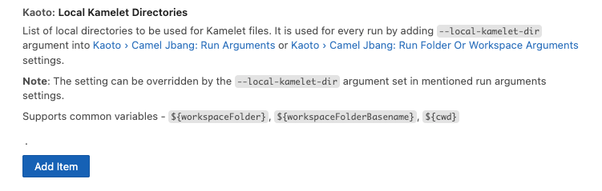
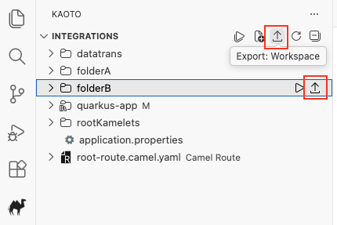
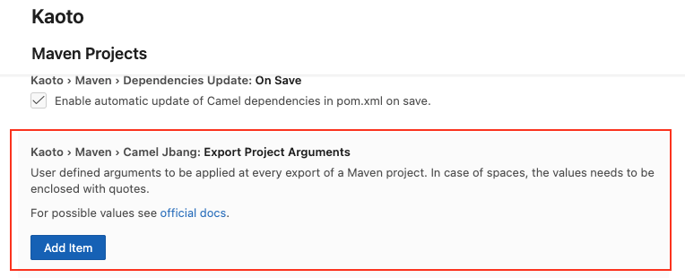
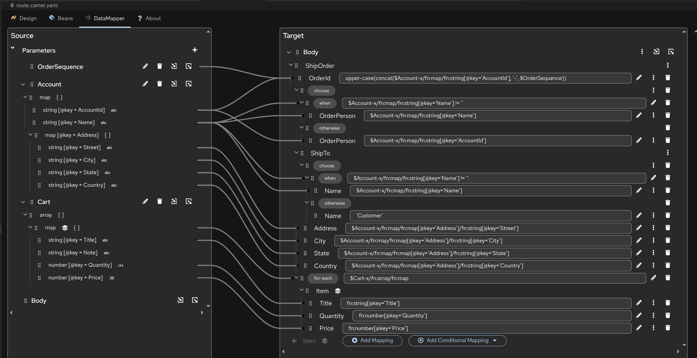
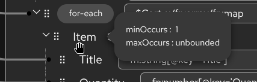
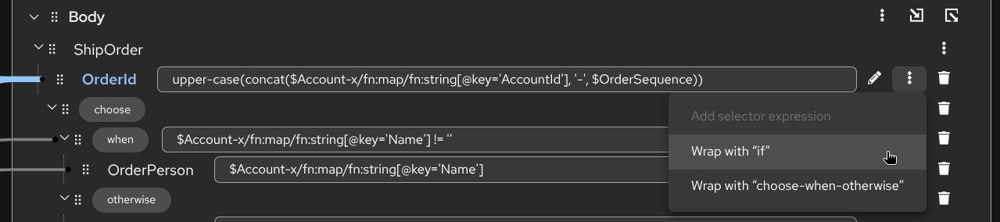
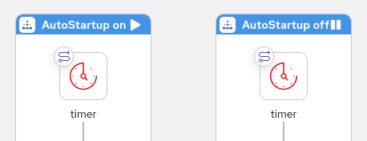

# Kaoto 2.9 released

We are happy to announce that new version of extension was released!

## Key highlights of this release

This release includes several requested features for the DataMapper, more Canvas UX improvements alongside with architectural improvements that lay the groundwork for interesting catalog use cases, but more on that in the upcoming releases.

### Integrations view

#### Tree-like structure

- Displays workspace roots and nested folders that contain matching integration files.
- Highlights Maven roots and children; preserves integration‑specific item types (Route, Pipe, Kamelet).

    

#### Buttons for running Folders and Workspace

`Run: Folder` and `Run: Workspace` options

- **Added Run: Folder command**: Allows users to run all Camel files within a specific folder from the Integrations view
- **Added Run: Workspace command**: Enables running all Camel files across the entire workspace
- **Added Run: All Workspaces command**: Enables running all workspaces. Each in dedicated terminal view.
- **New configuration setting**: Added `kaoto.camelJbang.runFolderOrWorkspaceArguments` for customizing run arguments when executing folders/workspaces

    

#### Local Kamelets directories User setting

Introducing a new user setting `kaoto.localKameletDirectories` that allows users to specify a list of local directories containing Kamelet files. The setting automatically injects the `--local-kamelet-dir` argument into Camel JBang run commands, providing a cleaner and more maintainable way to configure local Kamelet directories compared to manually adding the argument to run settings.

    

#### Buttons for exporting into Maven-based project

Export functionality for folders and workspaces in the Integrations view and adding kamelet directory loading during export operations.

- `Export: Folder` and `Export: Workspace`

    

- User setting for providing additional export arguments

    

---

### DataMapper Enhancements
In 2.9, we've introduced several improvements to make complex data transformations more intuitive:

#### **Improved Document Visualization**

The document tree visualization has been improved. Now you can see a lot more document fields and mappings without scrolling. It especially helps to oversee larger documents and complex mappings.

    

#### **Field Occurrence Indicators**

You can now see minOccurs and maxOccurs constraints for schema fields, making it easier to understand field cardinality requirements at a glance.

    

#### **Wrap-with-If Action**

You can now wrap already mapped fields with a conditional "if" statement, making it easier to add logic to existing transformations without starting over. Thank you [Sarthak Vaish](https://github.com/sarth-akvaish) for this contribution.

    

#### **Improved Drag & Drop on DataMapper step**

Better handling of Drag & Drop on DataMapper step, avoid breaking the DataMapper step contents when its position is swapped

#### **Root Element Persistence**

When attaching an XML schema with multiple root elements, your chosen root element is now properly saved and restored when reopening the DataMapper.

---

### Canvas and UI Polish

We're happy to thank the amazing work from our contributors, who made several tweaks to the graphical editor to improve clarity and workflow:

- **Route Auto-Startup Indicator:** The canvas now visually indicates if a route is set to start up automatically, giving you better visibility into your integration’s lifecycle at a glance. Many thanks to [Sarthak Vaish](https://github.com/sarth-akvaish) for this contribution.

    

- **Updated EIPs Icons:** New icons have been added for specific EIPs (like Poll) and layout elements to help distinguish between different types of steps more easily. Again, thank you [Sarthak Vaish](https://github.com/sarth-akvaish) for this contribution.

    

- **Flicker-free Image Export:** Exporting your flows as images is now smoother and higher quality, with fixes to prevent UI distortion during the process. Thank you [Hitesh Sachdeva](https://github.com/hsachdeva9) for this contribution.
- **Improved Serialization:** Better handling of placeholders `{{ }}` in parameters to ensure your routes don't fail during XML serialization. Thank you [Sarthak Vaish](https://github.com/sarth-akvaish) for the fix.

---

For a full list of changes please refer to the [change log.](https://github.com/KaotoIO/kaoto/releases/tag/2.9.0)

### Let’s Build it Together

Let us know what you think by joining us in the [GitHub discussions](https://github.com/orgs/KaotoIO/discussions).
Do you have an idea how to improve Kaoto? Would you love to see a useful feature implemented or simply ask a question? Please [create an issue](https://github.com/KaotoIO/kaoto/issues/new/choose).

### A big shoutout to our amazing contributors

Thank you to everyone who made this release possible! A special welcome to our new contributors: **@sarth-akvaish** and **@hsachdeva9**.

Whether you are contributing code, reporting bugs, or sharing feedback in our [GitHub discussions](https://github.com/KaotoIO/kaoto/discussions), your involvement is what keeps the Camel riding! 🐫🎉
